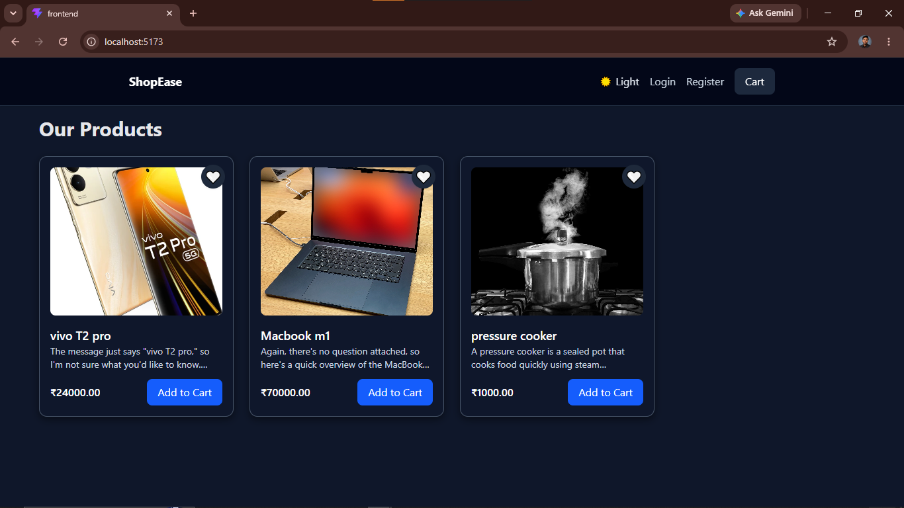
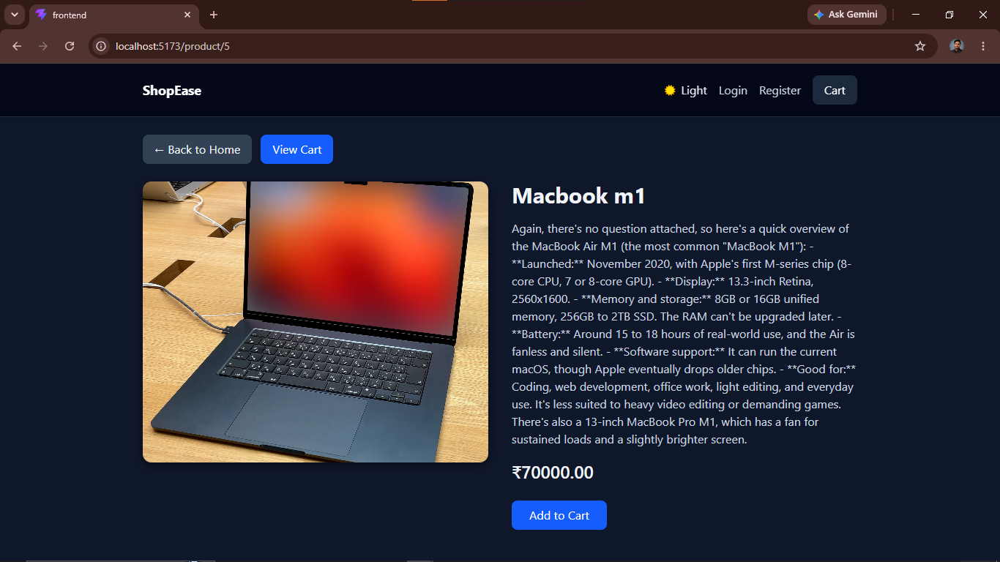
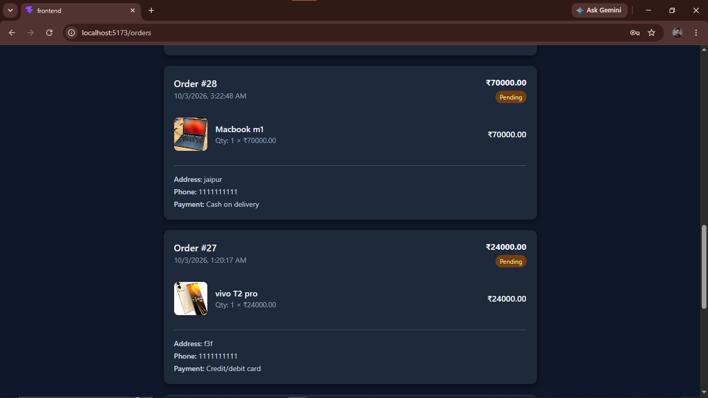

# 🛍️ ShopEase

A full-stack e-commerce web app built with **Django REST Framework** and **React (Vite + Tailwind CSS)**. It covers the complete shopping flow: browsing, cart, checkout with Razorpay, order tracking and invoices, plus an **AI-powered natural-language search** that understands English, Hindi and Hinglish.

> Try searching: `30000 ke neeche achha phone dikhao`

---

## ✨ Features

**Shopping**
- Product listing with category filter, sorting and skeleton loaders
- Product details page with reviews and ratings
- Cart and a separate checkout page
- Wishlist and saved addresses
- Dark mode with a black and candy red theme, hover and page-transition animations

**Orders and payments**
- Place orders with COD, UPI or card
- Razorpay payment integration (test mode)
- Order history, cancel order, status tracking timeline
- Invoice PDF download (ReportLab)
- Order status editable from the Django admin

**Accounts**
- Register, login and logout (DRF token authentication)
- Profile edit and password change

**🤖 AI Search**
- Natural-language product search powered by the **Groq API**
- Understands English, Hindi and Hinglish queries
- Shows what it understood as chips (category, keywords, price range)
- Automatic fallback to rule-based search if the AI is unavailable (see below)

**Developer experience**
- Interactive API docs with Swagger UI (`/api/docs/`) via drf-spectacular

---

## 🧰 Tech Stack

| Layer | Technology |
|---|---|
| Frontend | React, Vite, Tailwind CSS, Context API |
| Backend | Django, Django REST Framework |
| Database | PostgreSQL |
| Payments | Razorpay (test mode) |
| AI | Groq API (free tier) |
| Docs | drf-spectacular (Swagger UI) |
| PDF | ReportLab |

---

## 📸 Screenshots

> Add your screenshots in a `screenshots/` folder and update the paths below.

| Home | Product details |
|---|---|
|  |  |

| AI search | Orders |
|---|---|
|  |  |

---

## 🧠 How AI Search works

```
User query  ──►  POST /api/ai-search/
                    │
                    ├─ 1. Groq LLM turns the query into JSON filters
                    │      (keywords, category_id, min/max price, sort)
                    ├─ 2. Filters are validated (the LLM output is never trusted blindly)
                    ├─ 3. Django ORM runs the search with those filters
                    └─ 4. Response: { ai_used, understood[], products[] }
```

- **Category aware:** when a category is detected, only products of that category are returned.
- **Safe fallback:** if the API key is missing, the model is unavailable or the rate limit is hit, a rule-based parser (`fallback_filters`) extracts the price (`30000`, `30k`), direction (`neeche`, `upar`, `under`, `above`) and sort hints (`sasta`, `mehenga`). The response then has `ai_used: false`, and the search still works.
- **Rate limited:** the endpoint is throttled to protect the free-tier quota.
- **Debounced on the frontend** (600 ms), and falls back to the normal search if the AI endpoint fails.

Example response:

```json
{
  "ai_used": true,
  "understood": ["Category: Mobile", "Keywords: phone", "Up to ₹30000"],
  "products": [ ... ]
}
```

---

## 🚀 Getting Started

### Prerequisites
- Python 3.12+
- Node.js 18+
- PostgreSQL

### 1. Clone

```bash
git clone https://github.com/Dhirubhai06/shopease-ecommerce.git
cd shopease-ecommerce
```

### 2. Backend

```bash
cd Backend
python -m venv venv
venv\Scripts\activate          # Windows
# source venv/bin/activate     # macOS / Linux

pip install -r requirements.txt
```

Create a `.env` file inside `Backend/` (see `.env.example`):

```env
DB_NAME=ecommerce_db
DB_USER=postgres
DB_PASSWORD=your_db_password
DB_HOST=localhost
DB_PORT=5432

RAZORPAY_KEY_ID=rzp_test_xxxxxxxx
RAZORPAY_KEY_SECRET=your_razorpay_secret

EMAIL_HOST_USER=your_email@gmail.com
EMAIL_HOST_PASSWORD=your_gmail_app_password

GROQ_API_KEY=your_groq_api_key
GROQ_MODEL=your_groq_model_name
```

> 🔐 Never commit `.env`. Get a free Groq key at [console.groq.com/keys](https://console.groq.com/keys).
> Model names change over time. List the models available to your key with `GET https://api.groq.com/openai/v1/models` and pick a chat model that supports JSON mode.

Run migrations and start the server:

```bash
python manage.py migrate
python manage.py createsuperuser
python manage.py runserver
```

Backend runs at `http://127.0.0.1:8000`.

### 3. Frontend

```bash
cd frontend
npm install
```

Create `frontend/.env`:

```env
VITE_DJANGO_BASE_URL=http://127.0.0.1:8000
```

```bash
npm run dev
```

Frontend runs at `http://localhost:5173`.

---

## 📚 API Documentation

Interactive docs: **http://127.0.0.1:8000/api/docs/**

| Endpoint | Method | Description |
|---|---|---|
| `/api/products/` | GET | List products (`search`, `category`, `sort` query params) |
| `/api/categories/` | GET | List categories |
| `/api/ai-search/` | POST | Natural-language search, body: `{"query": "..."}` |
| `/api/orders/create/` | POST | Place an order |

Auth, orders, wishlist, addresses, reviews and profile endpoints are all listed in Swagger.

---

## 📁 Project Structure

```
shopease-ecommerce/
├── Backend/
│   ├── backend/            # Django project settings and urls
│   ├── store/              # Main app
│   │   ├── models.py
│   │   ├── serializers.py
│   │   ├── views.py
│   │   ├── ai_search.py    # Groq query parsing, validation, fallback
│   │   └── order_flow.py
│   ├── manage.py
│   └── requirements.txt
└── frontend/
    └── src/
        ├── pages/          # ProductList, ProductDetails, CartPage, Orders, Auth ...
        ├── components/     # ProductCard, Navbar, ProductCardSkeleton ...
        └── context/        # CartContext, AuthContext
```

---

## 🧪 Tests

```bash
cd Backend
python manage.py test
```

---

## 🗺️ Roadmap

- [ ] Light mode polish for cards and navbar
- [ ] Deployment (or a hosted demo)
- [ ] More unit tests for AI search

---

## 🎥 Demo

> Add a demo video or GIF link here.

---

## 📄 License

This project is for learning and portfolio purposes.

## 👤 Author

**Dhirubhai** · [GitHub](https://github.com/Dhirubhai06)
