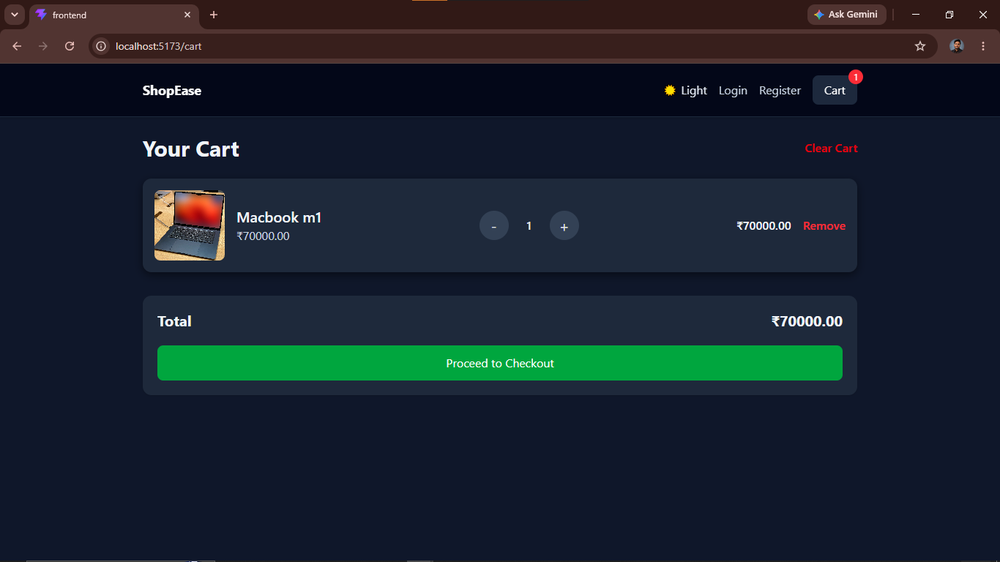
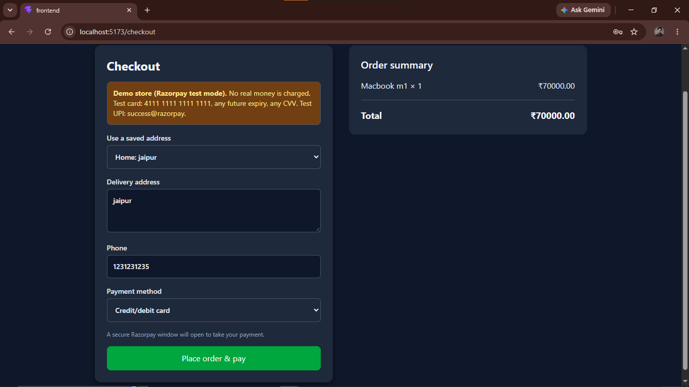
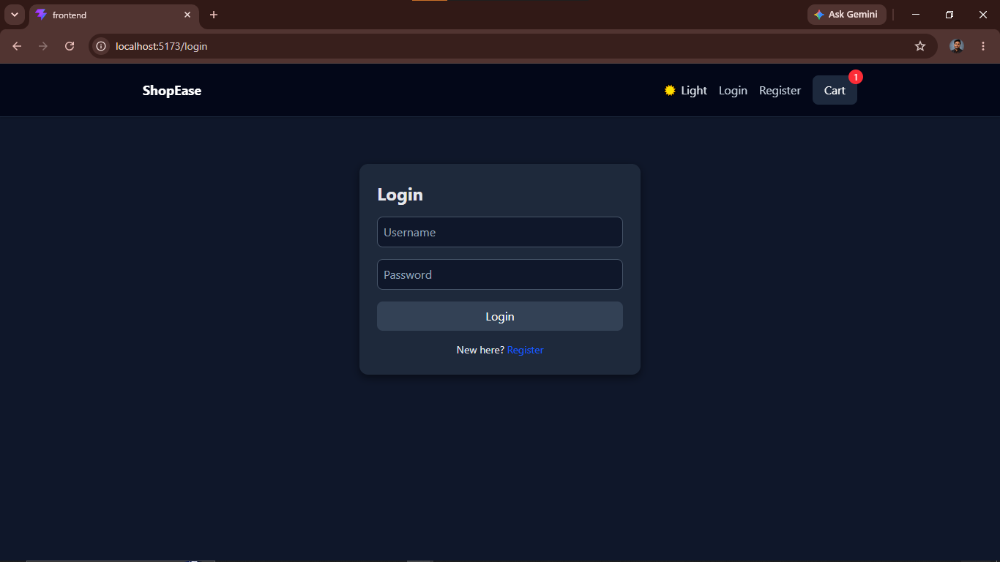

# ShopEase

A full stack e-commerce web app built with **Django REST Framework** and **React (Vite)**. 
Users can browse products, manage a cart, register and log in, save addresses, keep a wishlist, place orders and pay online with **Razorpay (test mode)**.

**GitHub:** [https://github.com/YOUR-USERNAME/YOUR-REPO](https://github.com/Dhirubhai06/shopease-ecommerce)
**Live demo:** coming soon

## Features
- Product listing and product details
- Cart with quantity update and remove
- User registration and login (token authentication)
- Checkout page (address, phone, payment method)
- Order history for each user

## Tech Stack
- **Frontend:** React, Vite, Tailwind CSS, React Router
- **Backend:** Django, Django REST Framework

## Screenshots
| Home | Product Details |
|------|-----------------|
|  |  |

| Cart | Checkout |
|------|----------|
|  |  |

| My Orders |
|-----------|
|  |

| Login / Register |
|------------------|
|  |

## Run locally

### Backend
```bash
cd Backend
python -m venv venv
venv\Scripts\activate
pip install -r requirements.txt
cp .env.example .env
python manage.py migrate
python manage.py runserver
```

### Frontend
```bash
cd frontend
npm install
cp .env.example .env
npm run dev
```